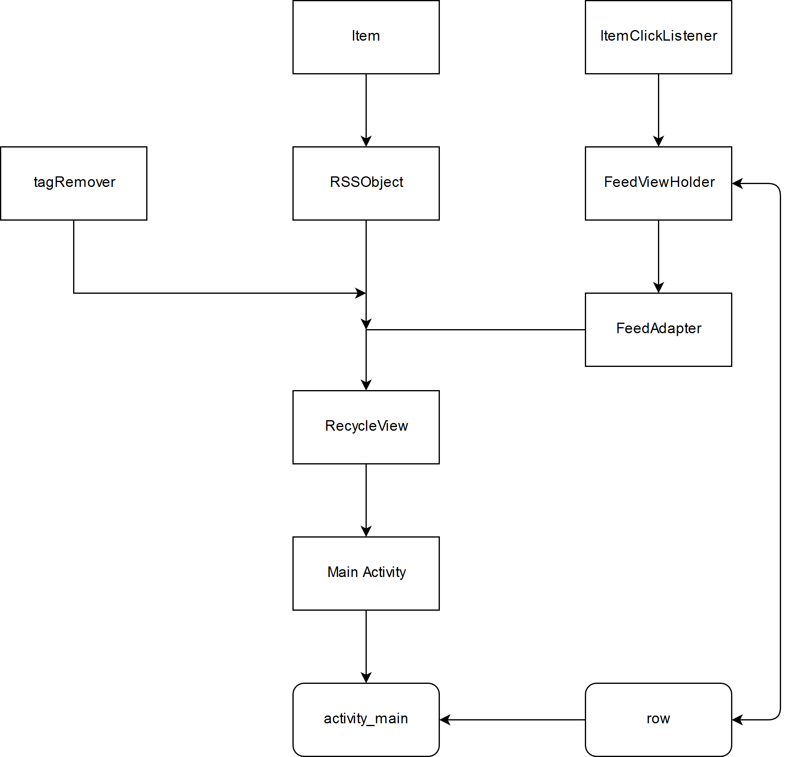

# BonchFeed
RSS news aggregator app for Android.

* [Project description](#project-description)
* [Structure](#structure)
* [Screenshot](#screenshot)

## Project description
This is my first app in my second year at university. App has simple functionality:
* parsing RSS webpages and making a scrollable list of items
* redirecting to the news source on item click
* buttons for adding and deleting webpages for parsing
 
## Structure
The app was developed using the MVP model. Code is located in folder **app/src/main/java/ss/kupp/bonchfeed/**. 
* Folder Model contains async webpage loader 
* Folder Presenter contains click listeners and feed adapter 
* Folder View contains main activity.

**App scheme**

## Screenshot

